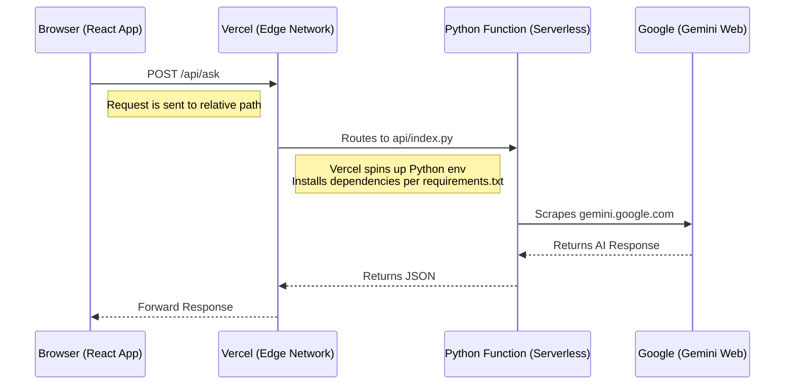

# How it Works: Vercel Serverless Architecture

Here is how the application functions without a dedicated server:

## Key Concepts

1.  **No Permanent Server**: Instead of a Python script running 24/7 on your computer or a VPS, Vercel creates a "Serverless Function" on demand.
2.  **Automatic Routing**: Vercel automatically looks at the `api/` folder. Any file there becomes an API endpoint. `api/index.py` handles requests to `/api/*`.
3.  **The "Scraper"**: The Python logic (copied from `Gemini3.py`) lives inside this serverless function. When a request comes in, it:
    *   Wakes up.
    *   Creates a fresh session with Google.
    *   Sends the prompt.
    *   Returns the result.
    *   Goes back to sleep (stops running).

## Deploying

Simply run `vercel` in your terminal (or connect your GitHub repo to Vercel). Vercel detects:
*   **Vite**: Builds your React frontend.
*   **Python**: Builds your API using `requirements.txt` and `api/index.py`.

It then serves both from the same URL (e.g., `https://your-app.vercel.app`).
